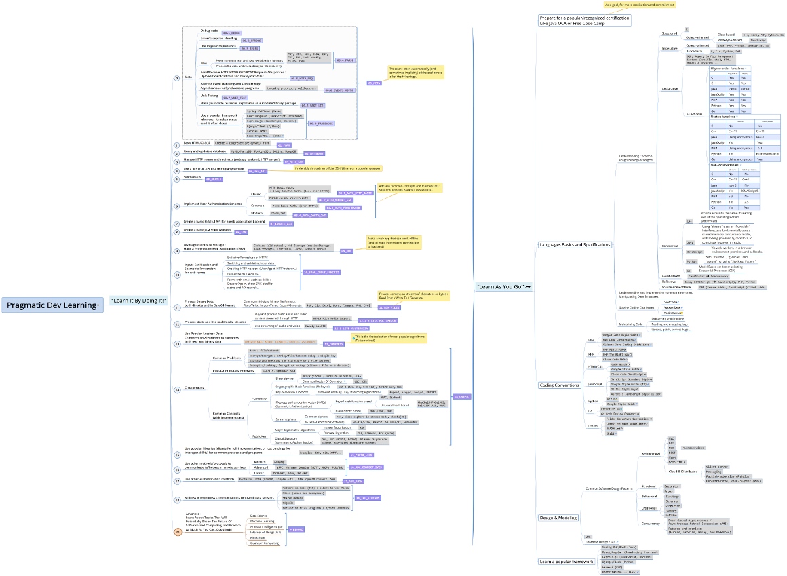
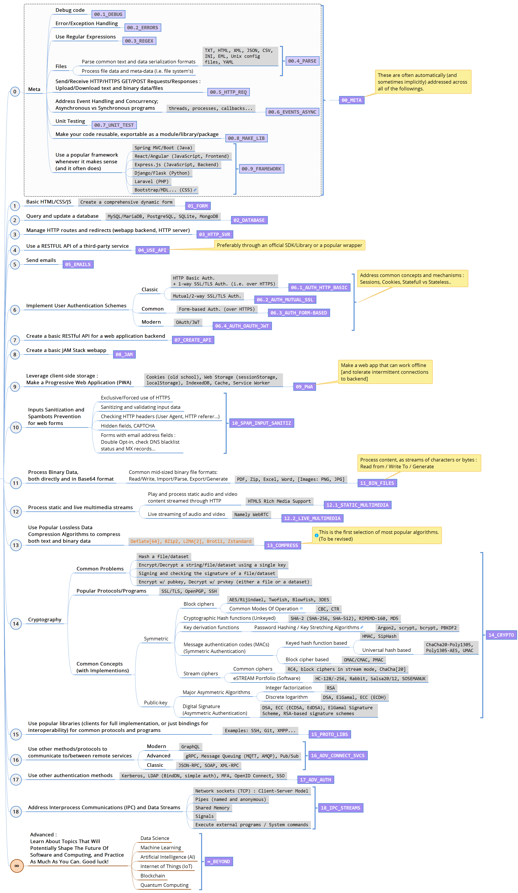
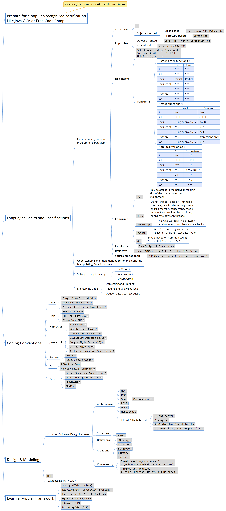

# Pragmatic Dev Learning

The **Pragmatic Dev Learning** project suggests a pragmatic approach to learning to code by exploring two parallel paths :

1. [_“Learn It By Doing It!”_](#1-learn-it-by-doing-it)
2. [_“Learn As You Go!”_](#2-learn-as-you-go)

The **“Learn It By Doing It!”** map consists basically of progressive units of knowledge and problems you can fairly easily search and find answers to. 

For example, you could be productive enough with just basic understanding of JavaScript's general syntax and functions. But, as you start using third-party libraries or try to implement some Object-Oriented concepts, you might find it challenging to make your code work if you don't understand the asynchronous and prototype-based nature of the language. That's where the **“Learn As You Go!”** map could come up quite handy, by showing you your *“unknown unknows”* to let you start searching and building up your knowledge, *hopefully* in a gradual and non-distracting way.

_For more details, check the [XMind](https://www.xmind.net/xmind8-pro/) mindmap included in this repository : [`LearnDev.xmind`](LearnDev.xmind)_

  

## 1. _“Learn It By Doing It!”_

Learn as you progressively develop a set of reusable ***snippets*** and ***boilerplate code*** addressing common technical problems —*referred to as **technical objectives***— that make up the building blocks of most applications. _(This sub-map is still actively revised)_ :

## 2. _“Learn As You Go!”_

Learn as you go, from recommended books, tutorials and official documentations.  _(This sub-map is occasionally revised)_  :

---------------------

## [DRAFT] Ideas / Philosophy / Principles / Project Motivations :
- *Yes, learning to code is more than just learning the syntax of a programming language, but it's also “less than” working on full projects.*
- *Interestingly, you'll often find yourself coming back here with new code snippets as you work on other projects. **Pragmatic Dev Learning** is a rather “non-linear” way of learning to code, encouraging everyone to develop bite-sized pieces of code addressing a neatly selected set of technical objectives. It should serve as an assessment of your learning progress; you don't have to be committed to a specific pace or method.*
- *Addressed mainly to people who have had a hard time finding learning resources beyond beginners' books that feel too easy and boring for them.*
- *If you think something is not necessary, just skip it!*
- *It doesn't matter whether you solve a problem natively (i.e. using the programing language's native/built-in tooling) or using a third-party library/tool/module/package, as long as:*
	- *it is recommended by fairly experienced developers (or at least, not recommended against)*
	- *you have the right to use it (you are aware of the license, costs...etc.)*
	- *there is at least one company/software editor supporting it, or, typically for open source software, the underlying project is still active and maintained. This ensures (to some extent) that this third-party software is unlikely to stop receiving required/critical updates, in a foreseeable future at least.*
	- *compared to alternatives :*
		- *it doesn't seem to be an "overkill"*
		- *it doesn't impact the overall performance of your app.*
	- *it makes one or both of the following :*
		- *app's source code shorter and/or more easily maintainable*
		- *app's runtime significantly (or at least reasonably) better*
- *The project will focus on core technical skills, at most with some concepts related to collaborative development like Git workflows; and leave everything else, like soft skills, team playing...etc. In other words, the main focus will be **helping people to learn to code**, and **not** necessarily **helping them land dev jobs**, because there are plenty of amazing resources and qualified communities addressing that specific topic.*
- *Project/Technologies choices are pretty opinionated*
- *“Pragmatic Dev Learning” covers the technical skills that make you immediately productive, that let you ship working/useful code, serving a specific need, no matter how simple/basic it is.*
- *At the end of each stage of the “Pragmatic Dev Learning” program, we should get a working software prototype with reusable code. This code would serve as a technical building block for larger projects. Ideally, we should be building and enhancing one final software product, as we go through the program, and thus take a CI/CD approach.*
- ***Collected Misc. Notes:** [`Notes.md`](/Notes.md)*
- ***For inspiration:***
	- *[The "Rationale" section of the `django-allauth` project README](https://github.com/pennersr/django-allauth/tree/e12112d03342b70a421aeebd4b6eecc7a7a211e8#rationale)*