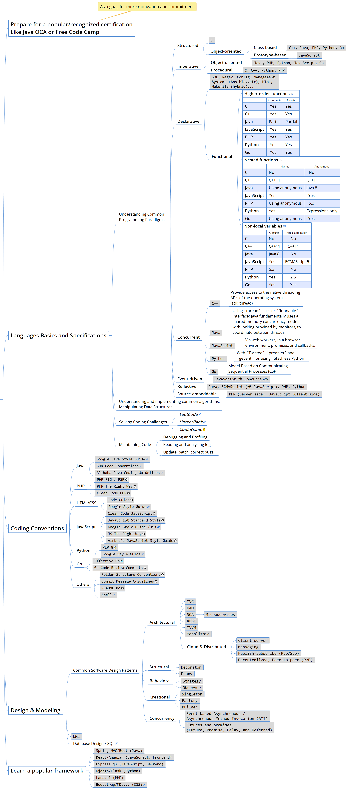

# Pragmatic Dev Learning

The **Pragmatic Dev Learning** project suggests a pragmatic approach to learning to code by exploring two parallel paths :

1. [_“Learn It By Doing It!”_](#1-learn-it-by-doing-it)
2. [_“Learn As You Go!”_](#2-learn-as-you-go)

 

_For more details, check the [XMind](https://www.xmind.net/xmind8-pro/) mindmap included in this repository : [`LearnDev.xmind`](LearnDev.xmind)_

## 1. _“Learn It By Doing It!”_

Learn as you progressively develop a set of reusable code snippets addressing common technical problems —*as technical objectives*— that make up the building blocks of most applications. _(This sub-map is still actively revised)_ :

## 2. _“Learn As You Go!”_

Learn as you go, from recommended books, tutorials and official documentations.  _(This sub-map is occasionally revised)_  :

 

## [DRAFT] Ideas / Philosophy / Principles / Project Motivations :
  > - *Yes, learning to code is more than just learning the syntax of a programming language, but it's also “less than” working on full projects.*
  > - *A rather “non-linear” way of learning to code.*
  > - *Addressed mainly to people who have had a hard time finding learning resources beyond beginners' books that feel too easy and boring for them.*
  > - *If you think something is not necessary, just skip it!*
  > - *It doesn't matter whether you solve a problem natively (i.e. using the programing language's native/built-in tooling) or using a third-party library/tool/module/package, as long as:*
  > 	- *it is recommended by fairy experienced developers (or at least, not recommended against)*
  > 	- *you have the right to use it (you are aware of the license, costs...etc.)*
  > 	- *there is at least one company/software editor supporting it, or, typically for open source software, the underlying project is still active and maintained. This ensures (to some extent) that this third-party software is unlikely to stop receiving required/critical updates, in a foreseeable future at least.*
  > 	- *compared to alternatives :*
  > 		- *it doesn't seem to be an "overkill"*
  > 		- *it doesn't impact the overall performance of your app.*
  > 	- *it makes one or both of the following :*
  > 		- *app's source code shorter and/or more easily maintainable*
  > 		- *app's runtime significantly (or at least reasonably) better*
  > - *I wonder if I would just focus on core technical skills, at most with some concepts related to collaborative development like Git workflows; and leave everything else, like soft skills, team playing...etc. In other words, the main focus of the project should be **helping people to learn to code**, and **not** necessarily **helping them land dev jobs**, because I'm not qualified for it.*
  > - ***For inspiration:***
  > 	- *[The "Rationale" section of the `django-allauth` project README](https://github.com/pennersr/django-allauth/tree/e12112d03342b70a421aeebd4b6eecc7a7a211e8#rationale)*