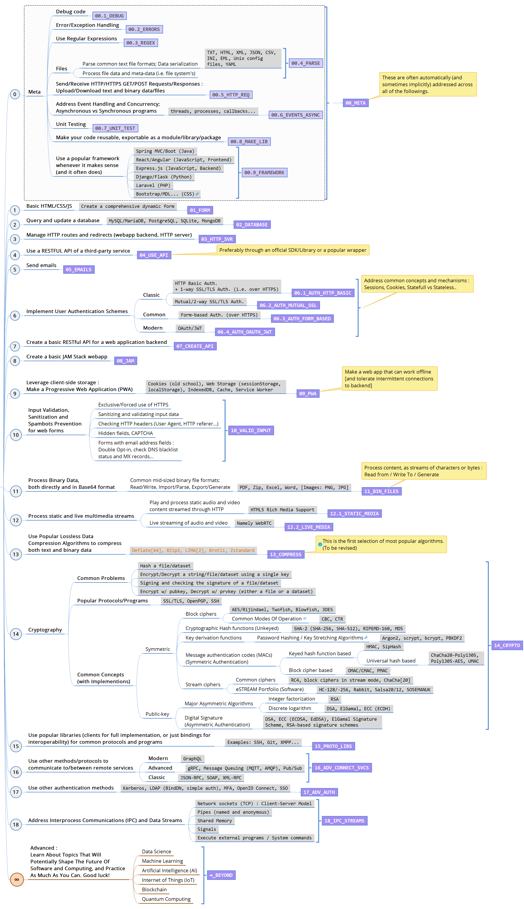

# Pragmatic Dev Learning

This project suggests a pragmatic approach to learning to code by exploring two parallel paths :
1. _“Learn It By Doing It!”_
2. _“Learn As You Go!”_

_For more details, check the [XMind](https://www.xmind.net/xmind8-pro/) mindmap included in this repository : [`LearnDev.xmind`](LearnDev.xmind)_

## 1. _“Learn It By Doing It!”_

Learn as you progressively develop a set of reusable code snippets addressing common technical problems that make up the building blocks of most modern applications :

## 2. _“Learn As You Go!”_

Learn as you go, from recommended books, tutorials and official documentations :

